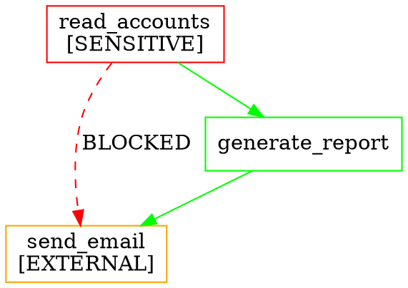

# ADR-006: Graphviz for Policy Graph Visualization

**Status:** Accepted  
**Date:** 2026-03-07  
**Context:** Guardian AI needs to render policy graphs as diagrams for debugging, auditing, and demo purposes. The visualization engine must support multiple output formats and highlight violations.

## Decision

**Use Graphviz (via DOT format generation)** as the primary visualization backend, with built-in ASCII rendering as a fallback.

## Alternatives Considered

| Tool | Approach | Output Formats | C++ Integration | Interactive | Dependency |
|------|---------|---------------|-----------------|-------------|------------|
| **Graphviz** | Generate DOT → render | SVG, PNG, PDF, DOT | ✅ Library or CLI | ❌ Static | Optional (CLI tool) |
| **D3.js** | JavaScript in browser | HTML/SVG | ❌ Requires web server | ✅ Yes | Heavy (browser) |
| **Cytoscape.js** | JavaScript in browser | HTML/SVG | ❌ Requires web server | ✅ Yes | Heavy (browser) |
| **mermaid** | Markdown-like syntax | SVG, PNG | ❌ Node.js required | ❌ Static | Medium |
| **Custom ASCII** | Built-in rendering | Text | ✅ Native | ❌ Static | None |

## Rationale

### Why Graphviz

**1. DOT is the lingua franca for directed graphs**

Guardian AI's policy graphs are directed graphs — exactly what DOT/Graphviz was designed for:


**2. No runtime dependency required**

Guardian AI generates DOT format strings natively. Users can:
- View `.dot` files in VS Code (Graphviz extension)
- Render to SVG/PNG with `dot -Tsvg policy.dot -o policy.svg`
- Use online viewers (Graphviz Online, Edotor)

Graphviz CLI is an **optional** dependency — if installed, Guardian renders directly; if not, it outputs DOT for the user to render.

**3. Matches the policy file format strategy**

The design already specifies DOT as a policy input format (Requirement 13). Using Graphviz for visualization creates a natural round-trip: load DOT → validate → render DOT with highlights.

**4. ASCII fallback for CLI demo**

The CLI tool needs terminal output without external dependencies. A built-in ASCII renderer handles this:
```
read_accounts ──→ generate_report ──→ encrypt ──→ send_email
      │                                              ▲
      └──────────── ✗ BLOCKED (exfiltration) ────────┘
```

### Why not D3.js or Cytoscape.js?

The high-level vision document describes a web dashboard — that's **post-MVP**. For the MVP C++ library + CLI:
- No web server to host JavaScript
- No browser to render HTML
- Adds massive dependency weight (Node.js ecosystem)

When the web dashboard is built (post-MVP), D3.js or Cytoscape.js can render the same DOT/JSON data that Graphviz uses. The visualization data format is decoupled from the rendering backend.

### Why not mermaid?

Mermaid requires Node.js for rendering — a non-starter for a C++ library. Mermaid is great for documentation but not for programmatic graph generation.

## Consequences

- Guardian generates DOT format natively (no dependency)
- Graphviz is an **optional** dependency for direct SVG/PNG rendering
- CLI tool includes ASCII renderer for terminal output
- DOT output can be consumed by web frontend (post-MVP)
- `#ifdef HAVE_GRAPHVIZ` guards in CMake for optional Graphviz library linking
