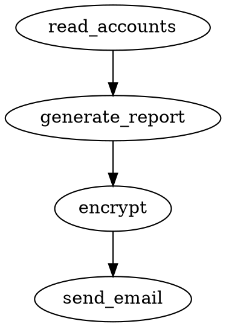

# ADR-007: JSON and DOT as Policy Graph Formats

**Status:** Accepted  
**Date:** 2026-03-07  
**Context:** Guardian AI needs a file format for defining security policies (tool nodes, allowed transitions, sandbox configs). The format must be human-readable, machine-parseable, and support round-trip serialization.

## Decision

**Support both JSON and DOT (Graphviz) formats** for policy graph definition, with JSON as the primary format.

## Alternatives Considered

| Format | Human-Readable | Machine-Parseable | Graph-Native | Schema Validation | Ecosystem |
|--------|---------------|-------------------|-------------|-------------------|-----------|
| **JSON** | ✅ Good | ✅ Excellent | ❌ No (generic) | ✅ JSON Schema | Universal |
| **DOT** | ✅ Good (graphs) | ⚠️ Custom parser | ✅ Yes | ❌ No | Graphviz |
| **YAML** | ✅ Excellent | ✅ Good | ❌ No (generic) | ✅ JSON Schema | Popular |
| **TOML** | ✅ Excellent | ✅ Good | ❌ No (generic) | ❌ Limited | Config-focused |
| **Protobuf** | ❌ Binary | ✅ Excellent | ❌ No | ✅ Built-in | Google ecosystem |
| **Custom DSL** | ✅ Best (tailored) | ❌ Custom parser | ✅ Yes (if designed) | ❌ Custom | None |

## Rationale

### Why JSON as primary format

**1. Richest metadata support**

Policy graphs need nested metadata (sandbox configs, conditions, node types). JSON handles this naturally:
```json
{
  "nodes": [{
    "id": "read_accounts",
    "node_type": "sensitive_source",
    "sandbox_config": {
      "memory_limit_mb": 64,
      "timeout_ms": 5000,
      "allowed_paths": ["/data/accounts"],
      "network_access": false
    }
  }]
}
```

DOT metadata is limited to flat key-value attributes — nested sandbox configs would require encoding hacks.

**2. nlohmann/json already in the stack**

JSON parsing is already a dependency (ADR-004). No additional library needed.

**3. JSON Schema for validation**

Policy files can be validated against a JSON Schema before loading, providing better error messages than runtime parsing failures.

### Why DOT as secondary format

**1. Graph structure is visually obvious**

DOT makes the graph topology immediately clear:


JSON requires reading an `edges` array and mentally reconstructing the graph.

**2. Graphviz ecosystem integration**

DOT files can be directly rendered with Graphviz tools, VS Code extensions, or online viewers. This is valuable for policy review and documentation.

**3. Quick policy prototyping**

Security administrators can sketch a policy as a DOT file first (visual), then convert to JSON (detailed) when they need sandbox configs.

### Why not YAML?

YAML is more readable than JSON, but:
- Adds a dependency (no header-only C++ YAML parser is as mature as nlohmann/json)
- YAML's implicit typing causes bugs (e.g., `on: true` becomes a boolean)
- JSON is strict — fewer parsing surprises for security-critical policy files

### Why not a custom DSL?

A custom DSL like HCL (Terraform) or Rego (OPA) would be the most expressive, but:
- Requires writing a parser (significant effort)
- Users must learn a new syntax
- No tooling support (syntax highlighting, linting)
- Overkill for MVP

This could be added post-MVP if JSON/DOT proves insufficient.

## Consequences

- JSON is the canonical format for policies with full metadata
- DOT is supported for import/export and visualization
- DOT → JSON conversion may lose sandbox config details (DOT attributes are flat)
- JSON → DOT conversion preserves graph structure but may simplify metadata
- Policy documentation should use DOT for visual clarity, JSON for complete definitions
