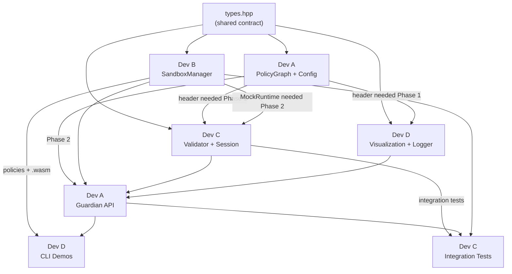

# Guardian AI — Overall Collaboration & Integration Plan

> **Repo:** [github.com/No-Reed/AIGuardian](https://github.com/No-Reed/AIGuardian)  
> **Team:** 4 developers (1 Linux + 3 Windows)  
> **Individual task files:** `dev-a-tasks.md`, `dev-b-tasks.md`, `dev-c-tasks.md`, `dev-d-tasks.md`

---

## Git & GitHub Setup (All Devs — Do This First)

### One-Time Setup (every developer runs these)

```bash
# 1. Clone the repo
git clone https://github.com/No-Reed/AIGuardian.git
cd AIGuardian

# 2. Configure git for cross-platform (CRITICAL for Windows devs)
git config core.autocrlf false
git config core.eol lf
git config pull.rebase true

# 3. Set your identity
git config user.name "Your Name"
git config user.email "your.email@example.com"

# 4. Verify .gitattributes and .editorconfig are present
ls .gitattributes .editorconfig .gitignore
```

### Creating Your Feature Branch

```bash
# Make sure you're on latest main
git checkout main
git pull origin main

# Create your feature branch
# Dev A:
git checkout -b feature/policy-graph

# Dev B:
git checkout -b feature/sandbox-manager

# Dev C:
git checkout -b feature/validator-session

# Dev D:
git checkout -b feature/viz-cli-docs
```

### Daily Workflow

```bash
# 1. Start of day: sync with main
git fetch origin
git rebase origin/main

# 2. Work on your tasks, make atomic commits (see commit points in your dev-X-tasks.md)

# 3. Push your branch
git push origin <your-branch-name>
# First time, set upstream:
git push -u origin <your-branch-name>
```

### Creating a Pull Request

```bash
# 1. Push all your commits
git push origin <your-branch-name>

# 2. Go to https://github.com/No-Reed/AIGuardian
# 3. Click "Compare & pull request"
# 4. Set base: main, compare: <your-branch-name>
# 5. Add description of what you implemented
# 6. Request reviewer (see review assignments below)
# 7. Wait for approval before merging

# After PR is merged, update your local main:
git checkout main
git pull origin main

# If continuing work, rebase your branch:
git checkout <your-branch-name>
git rebase main
```

### Commit Message Convention

Use this format for all commits:
```
<type>(<scope>): <short description>

<optional body with details>
```

| Type | When to use |
|------|------------|
| `feat` | New feature or functionality |
| `test` | Adding or updating tests |
| `fix` | Bug fix |
| `refactor` | Code restructuring without behavior change |
| `docs` | Documentation only |
| `build` | Build system or dependency changes |
| `perf` | Performance improvement |

Examples:
```
feat(policy-graph): implement adjacency list with add_node/add_edge
test(policy-graph): add property tests for JSON round-trip
feat(sandbox): implement WasmEdge runtime with timeout enforcement
build(cmake): add cross-platform flags for MSVC and GCC
docs(readme): add quick start guide and API overview
```

---

## Team Roster

| Role | Scope | OS | Branch |
|------|-------|----|--------|
| **Dev A** | Policy Graph + Config + Guardian API | Windows | `feature/policy-graph` |
| **Dev B** | Sandbox Manager + Wasm Tools + Policies | Linux | `feature/sandbox-manager` |
| **Dev C** | Validator + Session Manager + Interceptor | Windows | `feature/validator-session` |
| **Dev D** | Visualization + CLI + Logging + Docs | Windows | `feature/viz-cli-docs` |

---

## The Shared Contract: `types.hpp`

All 4 developers code against a **single shared header** — `include/guardian/types.hpp`. This file defines every struct and enum that crosses component boundaries:

- `RiskLevel`, `NodeType` — enums used by Policy Graph + Validator + Visualization
- `SandboxConfig`, `SandboxResult`, `SandboxViolation` — shared between Sandbox Manager + Interceptor + Guardian API
- `ToolCall` — shared between Interceptor + Session Manager + Validator
- `ValidationResult`, `CycleInfo`, `ExfiltrationPath` — shared between Validator + Interceptor + CLI + Guardian API

> **Rule:** Any change to `types.hpp` requires a PR reviewed by all 4 developers before merging.

---

## Development Phases

### Phase 1 — Parallel Component Development (All 4 devs work independently)

```
 Dev A: PolicyGraph + Config          Dev B: SandboxManager + MockRuntime
     │                                     │
     │  (push headers early)               │  (push MockRuntime early)
     ▼                                     ▼
 Dev C: PolicyValidator + Session     Dev D: Visualization + Logger
        (uses PolicyGraph header)           (uses PolicyGraph header)
```

**What happens:**
- Dev A pushes the project skeleton + `types.hpp` + empty headers to `main` on Day 1
- All devs create their feature branches from `main`
- Each dev implements their component and tests independently
- Dev A pushes `policy_graph.hpp` (full interface, empty `.cpp`) ASAP to unblock Dev C and Dev D
- Dev B pushes `sandbox_manager.hpp` with `MockRuntime` ASAP to unblock Dev C

**Phase 1 exit criteria:**
- [ ] Dev A: PolicyGraph passes all unit + property tests (JSON/DOT round-trip, node/edge operations)
- [ ] Dev B: SandboxManager passes all MockRuntime tests; WasmEdge integration tests pass on Linux
- [ ] Dev C: SessionManager + PolicyValidator pass all tests (cycle detection, exfiltration, caching)
- [ ] Dev D: VisualizationEngine generates valid DOT + ASCII; Logger passes all tests

### 🔀 Integration Checkpoint 1 — Merge Phase 1 to `main`

**Order of merging (to minimize conflicts):**
1. **Dev A merges first** — foundation (PolicyGraph, Config, CMakeLists)
2. **Dev B merges second** — SandboxManager (no conflicts expected)
3. **Dev C merges third** — Validator + Session (may need minor adjustments to match Dev A's final PolicyGraph API)
4. **Dev D merges last** — Viz + Logger (may need to adjust DOT generation for Dev A's final graph format)

**After all 4 merge:**
- [ ] `main` builds successfully with all components
- [ ] All individual unit tests pass together
- [ ] Team standup: discuss any interface mismatches and fix

---

### Phase 2 — Integration & User-Facing Features

```
 Dev A: Guardian API (wires all          Dev B: Wasm Tools + Demo Policies
        components together)                   (compiles .wasm, creates policy JSONs)
     │                                     │
     │  (push Guardian class)              │  (push policies + .wasm files)
     ▼                                     ▼
 Dev C: ToolInterceptor +              Dev D: CLI Demo Scenarios +
        Integration Tests                      Documentation
        (tests full pipeline)                  (builds the showcase)
```

**What happens:**
- Dev A wires PolicyGraph + PolicyValidator + SessionManager + SandboxManager + VisualizationEngine into the `Guardian` class
- Dev B compiles all 11 Wasm tools (Linux) and creates the 3 demo policy JSON files
- Dev C implements ToolInterceptor (the glue between validator and sandbox) and writes end-to-end integration tests
- Dev D implements CLI demo scenarios, interactive mode, and documentation

**Key integration points:**
- Dev A's `Guardian::execute_tool()` calls Dev C's `ToolInterceptor::intercept()` which calls Dev C's `PolicyValidator::validate()` then Dev B's `SandboxManager::execute_tool()`
- Dev D's CLI scenarios call Dev A's `Guardian` class with Dev B's policy files and Wasm tools

**Phase 2 exit criteria:**
- [ ] Dev A: Guardian API tests pass (init, validate, execute, session management)
- [ ] Dev B: All .wasm tools compile; all policies load correctly via PolicyGraph::from_json()
- [ ] Dev C: ToolInterceptor tests pass; integration tests for all 3 scenarios pass
- [ ] Dev D: CLI demo runs all 3 scenarios with colored output; docs complete

### 🔀 Integration Checkpoint 2 — Merge Phase 2 to `main`

**Order of merging:**
1. **Dev B merges first** — policies + Wasm tools (pure additions, no conflicts)
2. **Dev A merges second** — Guardian API (touches `guardian.hpp/cpp` that others depend on)
3. **Dev C merges third** — Interceptor + integration tests (uses Guardian API + policies)
4. **Dev D merges last** — CLI + docs (uses everything)

---

### Phase 3 — Performance, Final Validation, and Checkpoints (All devs together)

This phase maps to tasks.md tasks **4, 8, 13, 18, 19, 22, 23** — checkpoints are team sync points done together on `main`.

**Everyone works on `main` together:**

#### Checkpoint: Core Components Functional (tasks.md 4)
- [ ] All tests pass for PolicyGraph (Dev A) and SandboxManager (Dev B)
- [ ] WasmEdge integration verified with sample Wasm module (Dev B on Linux)
- [ ] Team meeting: review any questions or API mismatches

#### Checkpoint: Validation and Interception Complete (tasks.md 8)
- [ ] All tests pass for SessionManager, PolicyValidator, ToolInterceptor (Dev C)
- [ ] End-to-end flow verified: intercept → validate → sandbox execute
- [ ] Team meeting: review any questions or API mismatches

#### Checkpoint: Core Library Complete (tasks.md 13)
- [ ] All tests pass for Guardian API (Dev A)
- [ ] Complete end-to-end flow works with sample policy and Wasm modules
- [ ] Team meeting: review any interface issues

#### Checkpoint: Demos and Examples Complete (tasks.md 18)
- [ ] All CLI demos run successfully (Dev D)
- [ ] All 4 integration examples work (Dev A: 2, Dev B: 1, Dev C: 1)
- [ ] All 3 demo scenarios tested (Dev C integration tests)

#### Performance Optimization and Testing (tasks.md 19.1–19.3)

| What | Who | Target |
|------|-----|--------|
| Policy graph traversal optimization | Dev A | <10ms validation for 50 nodes |
| String interning, LRU cache tuning | Dev A + Dev C | <50ms for 200 nodes |
| Sandbox overhead benchmarks | Dev B | <50ms for simple tools |
| Wasm module caching | Dev B | Minimize reload time |
| Validation latency benchmarks | Dev C | >100 validations/sec |
| Memory pooling for ToolCall | Dev B + Dev C | <100MB for 1000 calls |
| Visualization performance | Dev D | <2s for 100-node graph |

#### Final Testing and Validation (tasks.md 22.1–22.4)
- [ ] Run complete test suite: unit + property + integration + performance (All)
- [ ] Run all 3 CLI demos and verify output (Dev D)
- [ ] Verify all examples compile and run (Dev A)
- [ ] Static analysis: clang-tidy on Linux (Dev B), MSVC /analyze on Windows (Dev A)
- [ ] Memory leak checks: valgrind on Linux (Dev B), DrMemory on Windows (Dev A)
- [ ] Thread safety verification under TSan (Dev C)
- [ ] Code formatting consistency check (Dev D)

#### Checkpoint: Project Complete (tasks.md 23)
- [ ] All tests passing
- [ ] All demos working
- [ ] All examples functional
- [ ] Documentation complete
- [ ] Ready for release

## Branch Strategy

```
main  ←──────────────── PR ──── feature/policy-graph     (Dev A)
  │                    ← PR ──── feature/sandbox-manager  (Dev B)
  │                    ← PR ──── feature/validator-session (Dev C)
  │                    ← PR ──── feature/viz-cli-docs     (Dev D)
```

- **Never push directly to `main`** — always via pull request
- Each PR needs at least **1 reviewer** (see review assignments below)
- Rebase your feature branch on `main` before making a PR
- Use `git pull --rebase origin main` regularly to stay in sync

### PR Review Assignments

| PR Author | Reviewer | Why |
|-----------|----------|-----|
| Dev A | Dev C | Shared PolicyGraph ↔ Validator interface |
| Dev B | Dev D | Loosely coupled, cross-check |
| Dev C | Dev A | Shared graph ↔ validator interface |
| Dev D | Dev B | Loosely coupled, cross-check |
| `types.hpp` changes | **All 4** | Shared contract |

---

## Dependency Map



### What each dev needs and when

| Dev | Needs from | What | When |
|-----|-----------|------|------|
| **A** | — | Nothing | — |
| **B** | — | Nothing | — |
| **C** | Dev A | `policy_graph.hpp` (interface declaration) | Phase 1 start |
| **C** | Dev B | `sandbox_manager.hpp` with `MockRuntime` | Phase 2 start |
| **D** | Dev A | `policy_graph.hpp` (for viz input types) | Phase 1 start |
| **D** | All | Guardian API + policies + Wasm tools | Phase 2 start |

---

## How the Components Connect at Runtime

```
AI Agent calls Guardian::execute_tool("read_accounts", params, session_id)
    │
    ▼
┌─────────────── Guardian API (Dev A) ───────────────────────┐
│                                                             │
│  1. SessionManager::get_sequence(session_id)    ← Dev C    │
│  2. ToolInterceptor::intercept(tool_call)       ← Dev C    │
│     │                                                       │
│     ├──→ PolicyValidator::validate(tool, seq)   ← Dev C    │
│     │    ├── check_transition(prev, current)    ← Dev C    │
│     │    ├── detect_cycle(sequence)             ← Dev C    │
│     │    └── detect_exfiltration(sequence)      ← Dev C    │
│     │                                                       │
│     ├── IF APPROVED:                                        │
│     │   └── SandboxManager::execute_tool()      ← Dev B    │
│     │       ├── Load .wasm module               ← Dev B    │
│     │       ├── Apply constraints (mem/timeout)  ← Dev B    │
│     │       └── Execute in WasmEdge VM          ← Dev B    │
│     │                                                       │
│     ├── SessionManager::append(tool_call)       ← Dev C    │
│     └── Logger::log(decision)                   ← Dev D    │
│                                                             │
│  3. VisualizationEngine::render_sequence()      ← Dev D    │
│                                                             │
└─────────────────────────────────────────────────────────────┘
    │
    ▼
CLI Demo Tool displays result with colors              ← Dev D
```

---

## Files at Risk of Merge Conflicts

| File | Owned by | Who else touches | Mitigation |
|------|----------|------------------|------------|
| `types.hpp` | Shared | All 4 devs | PR reviewed by all; freeze after Phase 1 |
| `CMakeLists.txt` | Dev A (initial) | Everyone adds targets | Dev A merges first; others add to bottom |
| `guardian.hpp` | Dev A | Dev C (interceptor), Dev D (viz) | Dev A owns; others submit PRs |

---

## Communication Checkpoints

| When | What | Who |
|------|------|-----|
| **Day 1** | Dev A pushes skeleton + types.hpp; all devs create branches | All |
| **Day 2** | Dev A pushes policy_graph.hpp interface; Dev B pushes MockRuntime | Dev A, Dev B |
| **End of Phase 1** | All devs open PRs; team reviews before merging | All |
| **Phase 2 kickoff** | Sync meeting: confirm all interfaces work together | All |
| **End of Phase 2** | All devs open PRs; merge in order | All |
| **Phase 3** | Everyone on main; daily sync until done | All |

---

## Cross-Platform Compatibility (Windows ↔ Linux)

> **This section is critical.** Read it before writing any code. Ignoring these rules will cause build failures, phantom diffs, and broken tests across OSes.

### 1. Line Endings — `.gitattributes` (already in repo)

The repo includes a `.gitattributes` file that forces LF line endings in the git index. This prevents:
- Phantom diffs where every line shows as changed
- Shell scripts (`.sh`) breaking on Linux due to CRLF characters
- Inconsistent file comparisons in tests

**All devs must run once after cloning:**
```bash
git config core.autocrlf false
```

Windows Git users: your editor may show LF files. This is correct — do NOT change the `.gitattributes`.

### 2. Path Separators — NEVER Hardcode `\` or `/`

**In C++ code**, always use `std::filesystem::path` which handles separators automatically:
```cpp
// ✅ CORRECT — works on both Windows and Linux
#include <filesystem>
namespace fs = std::filesystem;
fs::path policy_path = fs::path(config_dir) / "policies" / "financial.json";
fs::path wasm_path = fs::path(wasm_tools_dir) / (tool_name + ".wasm");

// ❌ WRONG — breaks on the other OS
std::string path = config_dir + "\\policies\\financial.json";  // breaks Linux
std::string path = config_dir + "/policies/financial.json";     // may break Windows APIs
```

**In JSON policy files**, always use forward slashes (even on Windows):
```json
{
  "wasm_module": "wasm_tools/read_accounts.wasm",
  "allowed_paths": ["/data/accounts"]
}
```

**In CMakeLists.txt**, CMake handles path separators natively — no special handling needed.

### 3. Compilers — MSVC vs GCC/Clang

| OS | Compiler | Flags to watch |
|----|----------|----------------|
| Windows | MSVC 2019+ (via Visual Studio or Build Tools) | `/std:c++17`, `/W4` |
| Linux | GCC 9+ or Clang 10+ | `-std=c++17`, `-Wall -Wextra` |

**CMakeLists.txt handles this** via `CMAKE_CXX_STANDARD 17`. But watch for:

| MSVC gotcha | Linux equivalent | Fix |
|-------------|-----------------|-----|
| `#pragma warning(disable: 4996)` | `-Wno-deprecated-declarations` | Use CMake: `target_compile_options()` |
| `_CRT_SECURE_NO_WARNINGS` for `sprintf` | Not needed | `#ifdef _MSC_VER` guard |
| No `__attribute__` support | GCC/Clang attributes | Use C++17 `[[nodiscard]]`, `[[maybe_unused]]` instead |
| `std::filesystem` needs no extra link | May need `-lstdc++fs` on older GCC | CMake: `target_link_libraries(... stdc++fs)` with GCC < 9 |

**Cross-platform compile guard pattern:**
```cpp
#ifdef _MSC_VER
    #define GUARDIAN_EXPORT __declspec(dllexport)
#else
    #define GUARDIAN_EXPORT __attribute__((visibility("default")))
#endif
```

### 4. Build Commands

| Step | Windows (PowerShell) | Linux (bash) |
|------|---------------------|-------------|
| Configure | `cmake -B build -G "Visual Studio 17 2022"` | `cmake -B build` |
| Build | `cmake --build build --config Release` | `cmake --build build` |
| Test | `cd build; ctest -C Release --output-on-failure` | `cd build && ctest --output-on-failure` |
| Clean | `Remove-Item -Recurse build` | `rm -rf build` |

> **Use `cmake --build build` on both** — it works everywhere without needing `make` or `msbuild`.

### 5. WasmEdge Availability

| What | Windows | Linux |
|------|---------|-------|
| WasmEdge SDK | ⚠️ Limited support; use vcpkg or manual build | ✅ Native packages; `curl -sSf https://raw.githubusercontent.com/WasmEdge/WasmEdge/master/utils/install.sh \| bash` |
| wasi-sdk | ❌ Not natively supported | ✅ Download from GitHub releases |
| `.wasm` compilation | ❌ Cannot compile Wasm tools | ✅ Dev B compiles and commits `.wasm` binaries |
| WasmEdge tests | ❌ Use `MockRuntime` only | ✅ Full integration tests |

**The solution:** Dev B (Linux) compiles `.wasm` files and commits them as binary artifacts. Windows devs use `MockRuntime` for all sandbox testing. The `.gitattributes` file already marks `.wasm` as binary.

### 6. Terminal Colors (Dev D — critical)

ANSI escape codes work natively on Linux but need explicit enabling on Windows 10+:

```cpp
#ifdef _WIN32
#include <windows.h>
void enable_virtual_terminal() {
    HANDLE hOut = GetStdHandle(STD_OUTPUT_HANDLE);
    DWORD dwMode = 0;
    GetConsoleMode(hOut, &dwMode);
    dwMode |= ENABLE_VIRTUAL_TERMINAL_PROCESSING;
    SetConsoleMode(hOut, dwMode);
}
#else
void enable_virtual_terminal() {} // no-op on Linux
#endif

// Call once at CLI startup
int main() {
    enable_virtual_terminal();
    // ...
}
```

### 7. File I/O and Timestamps

| Concern | Windows | Linux | Solution |
|---------|---------|-------|----------|
| File separator in `persist_session()` | `\` | `/` | Use `std::filesystem::path` |
| Timestamp format | Same | Same | Use `std::chrono` and `std::put_time` |
| File permissions | No execute bit | Has execute bit | Don't rely on file permissions in code |
| Temp directory | `%TEMP%` | `/tmp` | Use `std::filesystem::temp_directory_path()` |
| UUID generation | No native API | No native API | Use `<random>` with `mt19937` for portability |

### 8. CI/GitHub Actions (Recommended)

Set up a GitHub Actions workflow that builds on **both** OSes to catch issues early:

```yaml
# .github/workflows/build.yml
name: Build & Test
on: [push, pull_request]

jobs:
  build:
    strategy:
      matrix:
        os: [ubuntu-latest, windows-latest]
    runs-on: ${{ matrix.os }}
    steps:
      - uses: actions/checkout@v4
      - name: Install dependencies (Linux)
        if: runner.os == 'Linux'
        run: |
          curl -sSf https://raw.githubusercontent.com/WasmEdge/WasmEdge/master/utils/install.sh | bash -s -- -v 0.14.0
          sudo apt-get install -y graphviz
      - name: Configure
        run: cmake -B build -DCMAKE_BUILD_TYPE=Release
      - name: Build
        run: cmake --build build --config Release
      - name: Test
        run: cd build && ctest -C Release --output-on-failure
```

### 9. CMake Cross-Platform Pattern

Dev A should structure `CMakeLists.txt` to handle platform differences cleanly:

```cmake
# Compiler-specific flags
if(MSVC)
    target_compile_options(guardian PRIVATE /W4 /permissive-)
    target_compile_definitions(guardian PRIVATE _CRT_SECURE_NO_WARNINGS)
else()
    target_compile_options(guardian PRIVATE -Wall -Wextra -Wpedantic)
endif()

# WasmEdge: optional on Windows, required on Linux for full tests
find_package(WasmEdge 0.14.0 QUIET)
if(WasmEdge_FOUND)
    target_compile_definitions(guardian PRIVATE HAVE_WASMEDGE)
    target_link_libraries(guardian PUBLIC WasmEdge::wasmedge)
    message(STATUS "WasmEdge found — full sandbox support enabled")
else()
    message(STATUS "WasmEdge NOT found — using MockRuntime only")
endif()

# std::filesystem linking (older GCC)
if(CMAKE_CXX_COMPILER_ID STREQUAL "GNU" AND CMAKE_CXX_COMPILER_VERSION VERSION_LESS "9.0")
    target_link_libraries(guardian PUBLIC stdc++fs)
endif()
```

### 10. Code Patterns to Avoid

```cpp
// ❌ AVOID: Platform-specific headers without guards
#include <unistd.h>    // Linux only
#include <windows.h>   // Windows only

// ✅ CORRECT: Use guards
#ifdef _WIN32
    #include <windows.h>
#else
    #include <unistd.h>
#endif

// ❌ AVOID: System-specific commands
system("rm -rf /tmp/session_*");        // Linux only
system("del /Q %TEMP%\\session_*");     // Windows only

// ✅ CORRECT: Use std::filesystem
for (auto& entry : fs::directory_iterator(fs::temp_directory_path())) {
    if (entry.path().stem().string().starts_with("session_"))
        fs::remove(entry.path());
}

// ❌ AVOID: Hardcoded path separators
std::string path = dir + "/" + filename;

// ✅ CORRECT: Use std::filesystem::path
auto path = fs::path(dir) / filename;
```

---

## Quick Troubleshooting

| Problem | Solution |
|---------|----------|
| "I need PolicyGraph but Dev A hasn't implemented it yet" | Code against the header interface; use mock/stub in your tests |
| "I need .wasm files but I'm on Windows" | Use `MockRuntime` — it simulates sandbox behavior without real Wasm |
| "types.hpp needs a new field" | Open a PR adding only the types.hpp change; get all 4 to approve before continuing |
| "My code compiles but fails at integration" | Check interface match: are you using the exact same struct names, method signatures from headers? |
| "Merge conflict on CMakeLists.txt" | Dev A resolves; each dev adds their targets in a clearly marked section |
| "Git shows every line changed in a file" | Run `git config core.autocrlf false` and re-clone. Check `.gitattributes` is committed |
| "Build fails with `filesystem` errors on Linux" | Add `target_link_libraries(... stdc++fs)` in CMake for GCC < 9 |
| "`#include <unistd.h>` fails on Windows" | Add `#ifdef _WIN32` / `#else` guard around platform headers |
| "ANSI colors not showing on Windows" | Call `enable_virtual_terminal()` at startup (see Section 6 above) |
| "Path `policies\financial.json` fails on Linux" | Use `std::filesystem::path` — never hardcode `\` |
| "WasmEdge not found on Windows" | Expected. Use `MockRuntime`. Only Dev B (Linux) runs real WasmEdge tests |
| "Wasm tool compilation fails on Windows" | Don't compile Wasm on Windows. Dev B compiles and commits `.wasm` binaries |
